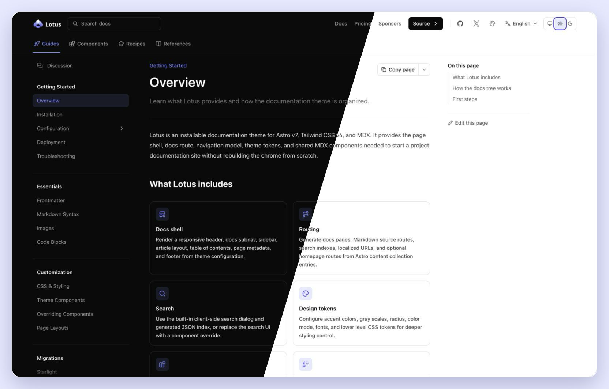

# Astro Theme Lotus

Lotus is a documentation theme for Astro. It gives you an installable docs
integration with MDX, sidebars, table of contents, search, dark mode, i18n,
theme tokens, and a small set of docs components.



## Install

```sh
npm install @prosefly/astro-theme-lotus
```

Install `@prosefly/astro-components` directly when your own MDX or Astro files
import shared components such as cards, steps, tabs, or callouts.

Add the integration:

```ts
// astro.config.ts
import { defineConfig } from 'astro/config';
import lotus from '@prosefly/astro-theme-lotus';
import themeConfig from './src/theme.config';

export default defineConfig({
  integrations: [lotus(themeConfig)],
});
```

Register your docs collection:

```ts
// src/content.config.ts
import { defineCollection } from 'astro:content';
import { docsLoader, docsSchema } from '@prosefly/astro-theme-lotus/content';

const docs = defineCollection({
  loader: docsLoader(),
  schema: docsSchema(),
});

export const collections = { docs };
```

Create docs in `src/content/docs/`. By default, Lotus renders docs from the
site root: `src/content/docs/index.mdx` renders at `/`, and
`src/content/docs/installation.mdx` renders at `/installation/`.

## Configure

```ts
// src/theme.config.ts
import { defineLotusConfig } from '@prosefly/astro-theme-lotus';

export default defineLotusConfig({
  name: 'Acme Docs',
  description: 'Documentation for Acme.',
  logo: '/logo.svg',
  navbar: [
    { label: 'Docs', href: '/' },
    { label: 'GitHub', href: 'https://github.com/acme/acme', external: true },
  ],
  sidebars: [
    {
      label: 'Guides',
      icon: 'lucide:rocket',
      items: [
        'overview',
        'installation',
        { label: 'Configuration', items: [{ autogenerate: { directory: 'configuration' } }] },
      ],
    },
  ],
});
```

## Features

- Astro v7 integration for documentation sites
- MDX content with configurable docs routes
- Responsive header, subnav, sidebar, main content, TOC, and footer
- Light, dark, and system theme modes
- Configurable accent color, gray palette, and radius
- Local search, Pagefind, and DocSearch providers
- i18n-aware routes, labels, and sidebar ownership
- Expressive Code support
- Iconify-powered icons
- Component overrides for shell pieces such as search, navigation, footer links,
  page metadata, and theme switch controls

## License

BSD-3-Clause
