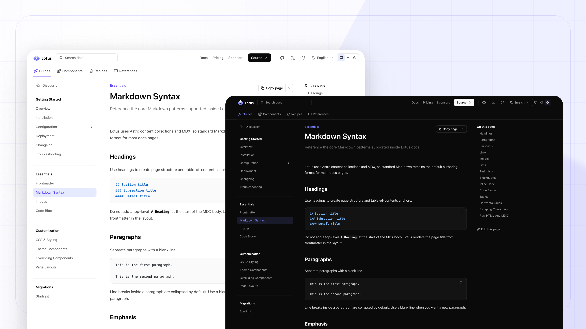

# Astro Theme Lotus

Lotus is an installable documentation theme for Astro v7, Tailwind CSS v4, and
MDX. It gives your project generated docs routes, responsive navigation, table
of contents, search, dark mode, i18n, theme tokens, and docs components without
turning the whole site into a theme fork.



## Quick Start

Start from the Lotus starter template when you want a working documentation site
with Astro, content collections, theme config, and example docs already wired
up.

```sh
pnpm create astro@latest my-docs --template prosefly/astro-template-lotus-starter
cd my-docs
pnpm dev
```

Template source:
[prosefly/astro-template-lotus-starter](https://github.com/prosefly/astro-template-lotus-starter)

## Add To An Existing Project

Install Lotus manually when you already have an Astro project or want to add the
docs shell one piece at a time.

```sh
npm install @prosefly/astro-theme-lotus
```

Install `@prosefly/astro-components` directly when your own MDX or Astro files
import shared components such as cards, steps, tabs, or callouts.

Add the integration:

```ts
// astro.config.ts
import { defineConfig } from 'astro/config';
import lotus from '@prosefly/astro-theme-lotus';

export default defineConfig({
  integrations: [lotus()],
});
```

Register your docs collection:

```ts
// src/content.config.ts
import { defineCollection } from 'astro:content';
import { docsLoader, docsSchema } from '@prosefly/astro-theme-lotus/content';

const docs = defineCollection({
  loader: docsLoader(),
  schema: docsSchema(),
});

export const collections = { docs };
```

Create docs in `src/content/docs/`. By default, Lotus renders docs from the
site root: `src/content/docs/index.mdx` renders at `/`, and
`src/content/docs/installation.mdx` renders at `/installation/`.

## Configure

Create `theme.config.json` in the project root. Options passed to
`lotus({...})` in `astro.config.ts` override values from this JSON file.

```json
{
  "$schema": "https://prosefly.dev/schema/lotus.json",
  "name": "Acme Docs",
  "description": "Documentation for Acme.",
  "logo": "/logo.svg",
  "siteNav": [
    { "label": "Docs", "href": "/" },
    { "label": "GitHub", "href": "https://github.com/acme/acme", "external": true }
  ],
  "docsNav": [
    {
      "label": "Guides",
      "icon": "lucide:rocket",
      "items": [
        "overview",
        "installation",
        {
          "label": "Configuration",
          "items": [{ "autogenerate": { "directory": "configuration" } }]
        }
      ]
    }
  ]
}
```

## Features

- Astro v7 integration for documentation sites
- MDX content with configurable docs routes
- Responsive header, subnav, sidebar, main content, TOC, and footer
- Light, dark, and system theme modes
- Configurable accent color, gray palette, and radius
- Global head entries for custom CSS, social cards, and verification tags
- Local search, Pagefind, and DocSearch providers
- i18n-aware routes, labels, and sidebar ownership
- Expressive Code support
- Iconify-powered icons
- Component overrides for shell pieces such as search, navigation, footer links,
  page metadata, and theme switch controls

## Links

- Documentation: <https://astro-theme-lotus.prosefly.dev/docs/overview/>
- Starter template:
  <https://github.com/prosefly/astro-template-lotus-starter>
- npm package: <https://www.npmjs.com/package/@prosefly/astro-theme-lotus>

## License

BSD-3-Clause
